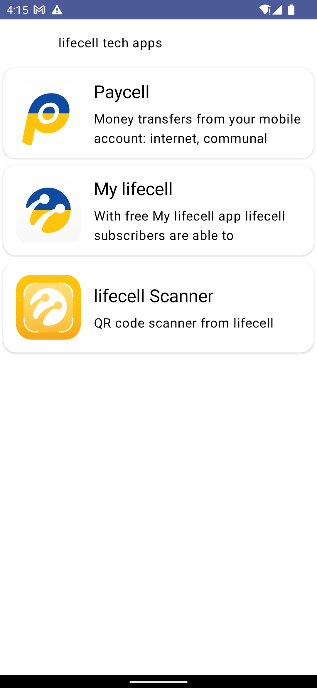
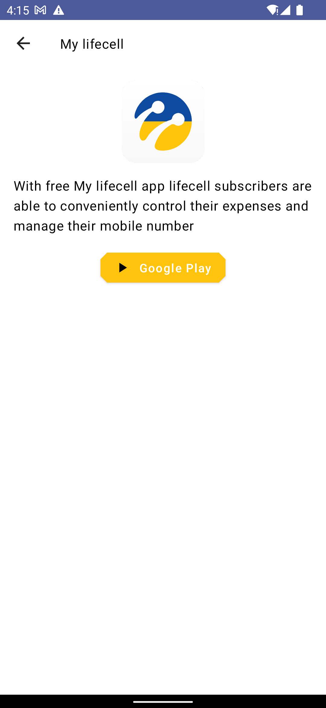
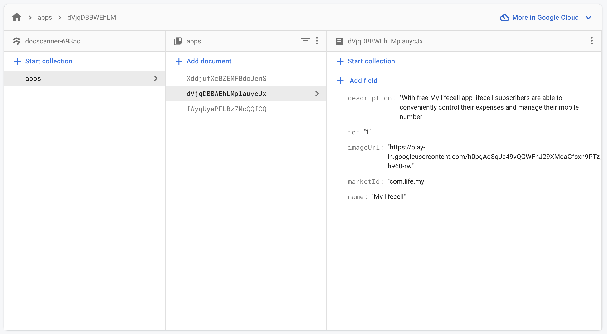

# StartApp is the base Android project
Tech stack:

- Kotlin
- MVVM
- Hilt
- Retrofit, Room, Firestore
- Coroutines + Flow
- Compose + Navigation

## New project creating
You can extends from this project for creating something new

- Pull StartApp project
- Change package name and applicationId
- Create Firebase project
- Add google-services.json
- Create new remote repo
- Push new project to new repo

## StartApp demo app 
StartApp downloads demo data from Firestore, saves them and shows for user

  


## Code snippets

Repository binding
``` kotlin
@Module
@InstallIn(SingletonComponent::class)
internal abstract class HiltImplementationsModule {

    @Binds
    abstract fun bindModelRepository(modelRepository: ModelRepositoryImpl): ModelRepository
}
```

ViewModel constructor injection
```kotlin
@HiltViewModel
class MainViewModel @Inject constructor(
    var modelRepository: ModelRepository,
    var app: Application,
    val savedStateHandle: SavedStateHandle
) : AndroidViewModel(app) {
    ///
}
```

Compose screen function with ViewModel injection
```kotlin
@Composable
fun MainScreen(
    onModelClick: (String, String) -> Unit
) {
    val viewModel = hiltViewModel<MainViewModel>()
    val models by viewModel.modelsUiState.collectAsState()

    MainUI(models, onModelClick)
}
```

Navigation
```kotlin
NavHost(
    navController = navController,
    startDestination = Screen.MainScreen.ROUTE,
    modifier = Modifier.padding(it)
) {
    composable(Screen.MainScreen.ROUTE) {
        titleText = context.getString(R.string.main_toolbar_title)
        MainHiltScreen(
            onModelClick = { id, name ->
                navController.navigate(Screen.DetailsScreen.getRouteWithParams(id, name))
            }
        )
    }
    composable(
        Screen.DetailsScreen.ROUTE_WITH_PARAMS,
        arguments = listOf(
            navArgument(Screen.DetailsScreen.ITEM_ID) {
                type = NavType.StringType
            },
            navArgument(Screen.DetailsScreen.ITEM_NAME) {
                type = NavType.StringType
            }
        )
    ) { entry ->
        titleText = entry.arguments?.getString(Screen.DetailsScreen.ITEM_NAME) ?: ""
        DetailsScreen ()
    }
}
```


For more information please pulls project with full code or contacts me
- [Mykyta Skubak email](mailto:mykyta.skubak@pe.liefecell.com)
- [Telegram](https://t.me/nikskubak)
